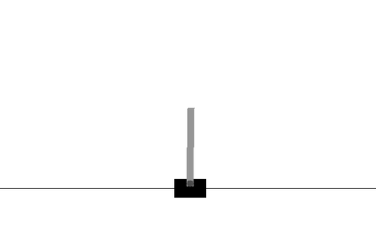

# DQN from Scratch in C

This repository contains a complete implementation of a Deep Q-Network (DQN) reinforcement learning algorithm from scratch in pure C, with no external dependencies. The project includes a custom implementation of the CartPole environment, neural network architecture, matrix operations, and visualisation capabilities.



## Project Overview

The entire project was built from the ground up to test and strengthen my proficiency in deep learning algorithms and reinforcement learning concepts.

## Features Implemented

### Deep Learning Components
- **Neural Network Framework**: Complete feedforward neural network with customisable layers
- **Matrix Operations**: Matrix operations
- **Activation Functions**: ReLU implementation
- **Loss Functions**: Huber loss
- **Adam Optimizer**: Advanced adaptive optimisation algorithm

### Reinforcement Learning Components
- **Experience Replay Buffer**: Stores and samples past experiences
- **Target Network**: Stabilises learning by slowly updating target Q-values
- **Epsilon-Greedy Policy**: Balances exploration and exploitation
- **Q-Learning**: Implements discounted rewards for long-term planning

### Environment and Visualization
- **CartPole Environment**: Classic control problem implementation (max_reward = 1)
- **Simple Graphics System**: Visualizes the CartPole state
- **Video Recording**: Capability to save agent episodes as Y4M videos

## Compilation

The project uses only the C standard library and gcc. No third-party dependencies are required.

To compile all executables, run:

```bash
gcc -Iinclude train.c src/*.c -o train -lm && \
gcc -Iinclude video.c src/*.c -o video -lm && \
gcc -Iinclude evaluate.c src/*.c -o evaluate -lm
```

This will produce three binaries:
- train: trains a DQN agent
- video: loads a trained model and records a single episode as a Y4M video
- evaluate: loads a trained model and runs evaluation episodes, reporting average reward

## Usage

### Training

```bash
./train [options]
```

Optional parameters:
- --lr <float>: learning rate (default 0.0001)
- --eps-max <float>: initial epsilon for exploration (default 1.0)
- --eps-min <float>: minimum epsilon (default 0.05)
- --eps-decay <float>: epsilon decay per step (default 1/4000)
- --gamma <float>: discount factor (default 0.99)
- --target-update <int>: steps between target network updates (default 100)
- --storage <int>: replay buffer size (default 1000)
- --batch <int>: batch size (default 32)
- --steps <int>: number of training steps (default 20000)

### Rendering

```bash
./video [options]
```

Optional parameters:
- --model <file>: model file to load (default model.bin)
- --out <file>: output video filename (default episode.y4m)

### Evaluating

```bash
./evaluate [options]
```

Optional parameters:
- --model <file>: model file to load (default model.bin)
- --episodes <n>: number of episodes to evaluate (default 1)

## Contact

If you have any questions about this project or are interested in discussing deep learning research opportunities, academic collaborations, or potential roles please reach out to me at tristanjlegg@gmail.com.

This project demonstrates my deep understanding of neural networks and reinforcement learning by implementing everything from scratch with no dependencies.
